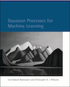
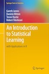
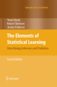

# Artificial Intelligence
*Bailey:* [Strong vs. Weak AI](https://katbailey.github.io/post/reframing-the-ai-effect/): (...) And humans use numerous abilities in playing chess. Surely an AI would need all those abilities too. But then along came Deep Blue: a computer that could beat any human chess player in the world, but could do absolutely nothing else. Surely this wasn’t the holy grail we had sought! (...)

## Machine Learning

### Regression
*srnghn@medium:* [Machine Learning: Trying to predict a numerical value](https://medium.com/@srnghn/machine-learning-trying-to-predict-a-numerical-value-8aafb9ad4d36)
- Linear Regression
- Decision Trees
- Neural Networks
- K-Nearest Neighbors

#### Gaussian Process, Kriging

##### Gaussian processes *by Martin Krasser*
[Krasser's Post](http://krasserm.github.io/2018/03/19/gaussian-processes/) exported from [here](http://nbviewer.jupyter.org/github/krasserm/bayesian-machine-learning/blob/master/gaussian_processes.ipynb?flush_cache=true)  
- *Murphy:* [__Machine Learning: a Probabilistic Perspective__](https://www.cs.ubc.ca/~murphyk/MLbook/index.html)
- *Bishop:* [Pattern Recognition and Machine Learning](https://www.microsoft.com/en-us/research/people/cmbishop/#!prml-book)
- *Rasmussen, Williams:* [__Gaussian Processes for Machine Learning__](http://www.gaussianprocess.org/gpml/)

##### Gaussian Processes for Dummies *by Katherine Bailey*
[Bailey's Post](https://katbailey.github.io/post/gaussian-processes-for-dummies/)  
(...) The GP approach, in contrast, is a non-parametric approach, in that it finds a distribution over the possible functions 
f(x) that are consistent with the observed data (...)

  - *Rasmussen, Williams:* [__Gaussian Processes for Machine Learning__](http://www.gaussianprocess.org/gpml/)
  - *Murphy:* [__Machine Learning: a Probabilistic Perspective__](https://www.cs.ubc.ca/~murphyk/MLbook/index.html)
  - *Bailey:* [__From both sides...__](http://katbailey.github.io/post/from-both-sides-now-the-math-of-linear-regression/)
    
    - *James, Witten, Hastie, Tibshirani:* [__An Introduction to Statistical Learning__](http://www-bcf.usc.edu/~gareth/ISL/index.html)
      - [lecture, video, slides](https://www.r-bloggers.com/in-depth-introduction-to-machine-learning-in-15-hours-of-expert-videos/)
      - *Hastie, Tibshirani, Friedman:* [__The Elements of Statistical Learning: Data Mining, Inference, and Prediction.__](https://web.stanford.edu/~hastie/ElemStatLearn//download.html)
    - *Davidson-Pilon:* [__Bayesian Methods for Hackers: Probabilistic Programming and Bayesian Inference__](https://github.com/CamDavidsonPilon/Probabilistic-Programming-and-Bayesian-Methods-for-Hackers)

##### The Kernel Cookbook *by David Duvenaud*
[Duvenaud's Post](https://www.cs.toronto.edu/~duvenaud/cookbook/)  
(...) "How do I choose the covariance function for a Gaussian process?" this is the page for you.(...)  
(...) You are the expert on your modeling problem - so you're the person best qualified to choose the kernel! (...)  
(...)  If want to let the computer run a search over kernels for you (...) [code](http://github.com/jamesrobertlloyd/gp-structure-search), [paper](http://arxiv.org/abs/1302.4922)
- [www.automaticstatistician.com](https://www.automaticstatistician.com/index/)
  - [Automatic Report](https://www.automaticstatistician.com/static/abcdoutput/01-airline.pdf), This report was produced by the Automatic Bayesian Covariance Discovery
(ABCD) algorithm.
- [GPSS Research](https://github.com/jamesrobertlloyd/gpss-research/)

##### Course: Statistical Learning *by Dr. Hastie and Dr. Tibshirani*
[Overview](https://www.r-bloggers.com/in-depth-introduction-to-machine-learning-in-15-hours-of-expert-videos/)  
- Chapter 1: Introduction
  - The first thing you do: look at the data, do some plots, do not start with fancy-analysis
  - Scatter-plot matrix to check for obvious correlations
  - we would like to: predict unseen test cases, understand how input affects output, assess quality of prediction

### Neural Networks
- *Wolchover for quantamagazine:* [New Theory Cracks Open the Black Box of Deep Learning](https://www.quantamagazine.org/new-theory-cracks-open-the-black-box-of-deep-learning-20170921/)
- *Kriesel:* [Ein kleiner Überblick über Neuronale Netze](http://www.dkriesel.com/science/neural_networks)

# Training
- [DataCamp](https://www.datacamp.com/courses/intro-to-python-for-data-science)
- [Google's Python Class](https://developers.google.com/edu/python/)
- [CodeWars](https://www.codewars.com/)

# Reading

