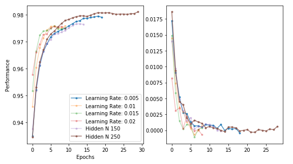

# Playing around with ANN

based on [Neuronale Netze selbst programmieren](https://www.oreilly.de/buecher/12892/9783960090434-neuronale-netze-selbst-programmieren.html)

### MNIST Classification Performance

### Wheight-Matrix over Time

